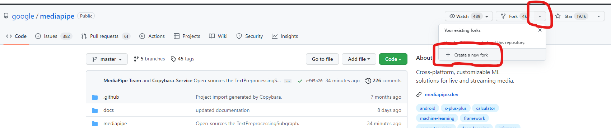
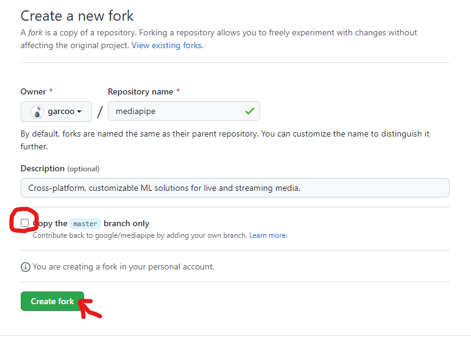

# git_training_textbook
Git講座の理解度を演習実施で確認 
自分のGitHubアカウントにForkして各演習問題のブランチをcheckout
  
# 演習前の予備知識 
講座内で説明していないけど演習で使うGitHubの機能ご紹介(Fork/Pull request)
 
## Forkとは
他人のリポジトリを自分のアカウントのリモートリポジトリにコピーすること 

### Forkのやりかた
Forkしたいリポジトリページ開いて右上の Fork > Create a new fork を選択

  
「Copy the master branch only」のチェックボックスを外してCreate forkボタンを押してください

  
最後に自分のRepositoriesを確認して、ForkしてきたRepositoryが存在することまで確認
   
## プルリクエスト(以下プルリク)とは
Githubの機能の一つ。誰でもどんなリポジトリに対しても、修正や機能追加を提案できる機能。 
簡単な概要は[こちら](https://qiita.com/matsukazu1112/items/1633e7392c827c03d533)が参考になると思います。 

### プルリクのやりかた
TODO

   
# 演習問題
 
# Sample1
